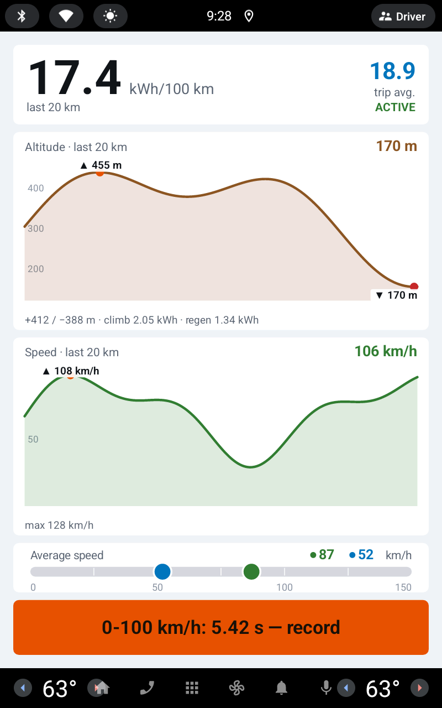
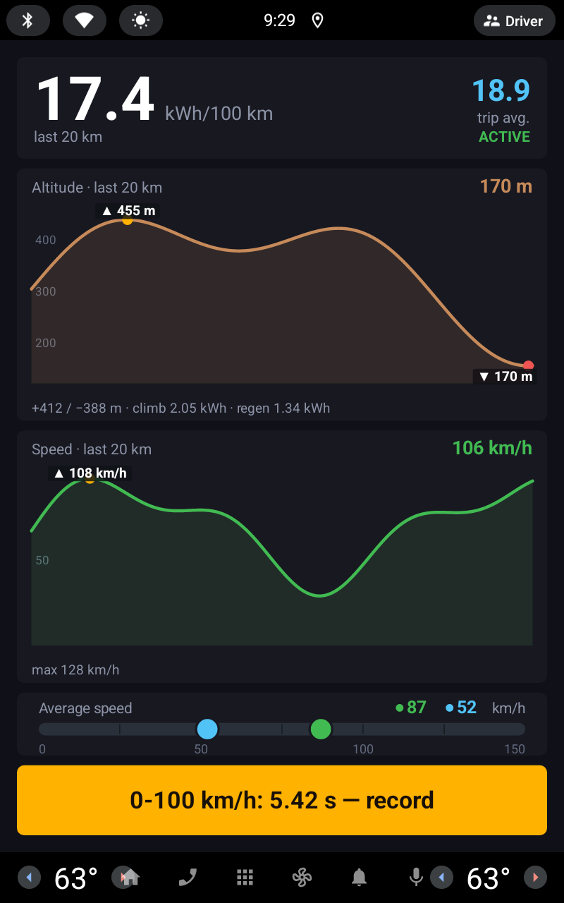
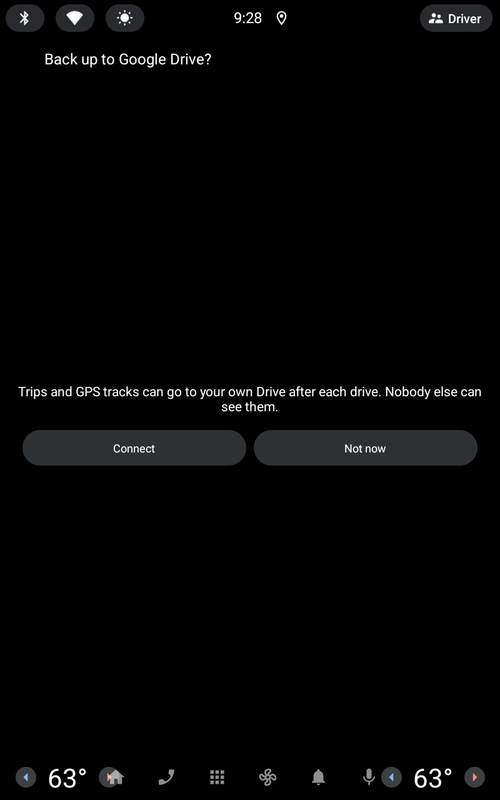
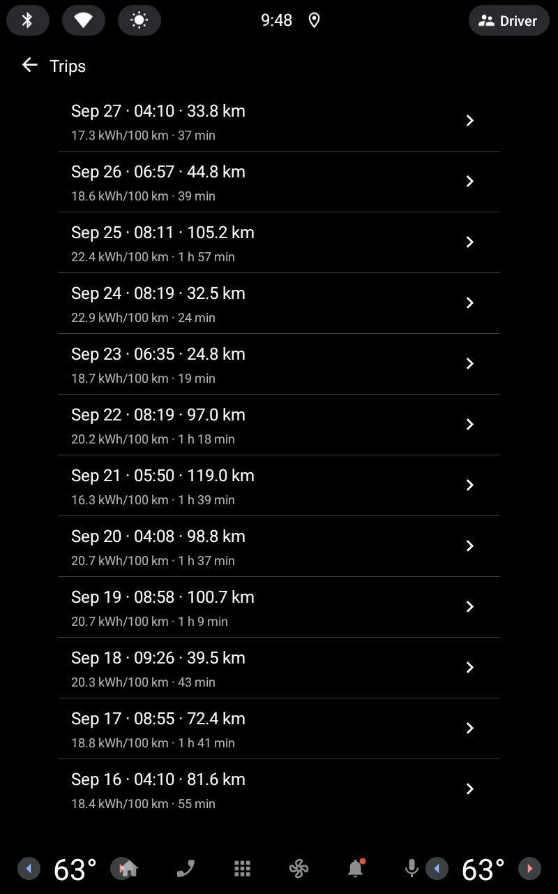
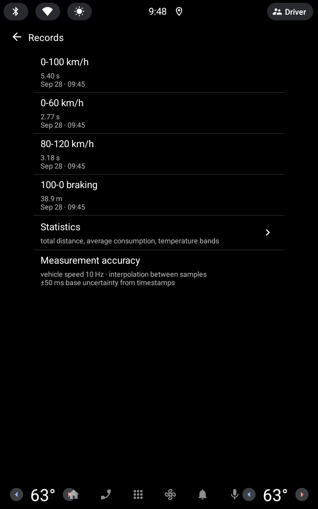
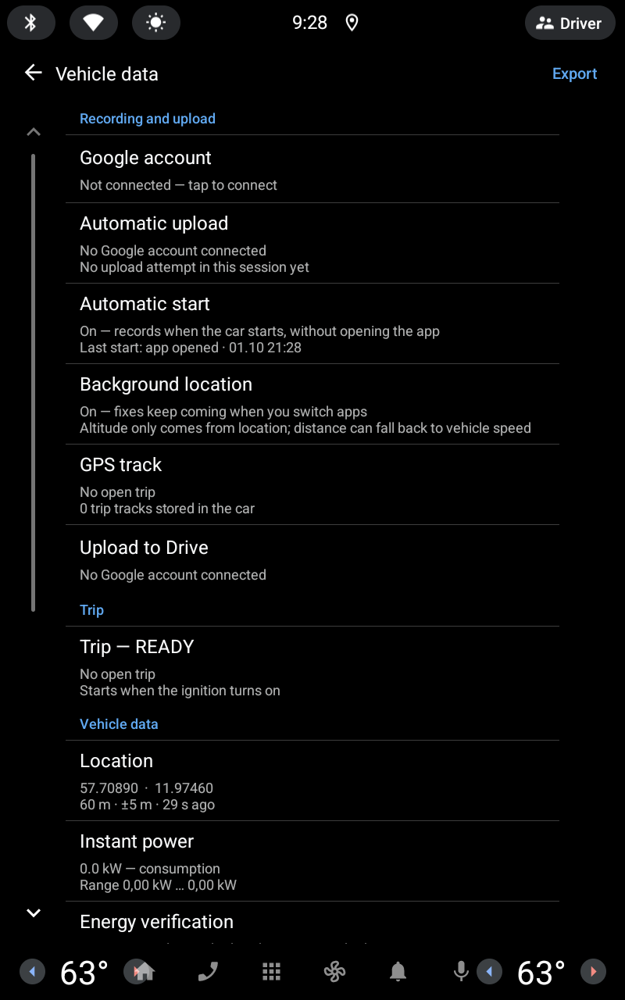

# EX30 Telemetry

**English** · [Türkçe](README.tr.md)

A trip computer and vehicle-data dashboard for the **Volvo EX30**, running
directly on the car's **Android Automotive OS** screen. It records every trip
automatically and shows live consumption, altitude, speed and energy data that
the stock UI does not expose.

> **Unofficial project.** Not affiliated with, endorsed by or supported by Volvo
> Cars. "Volvo" and "EX30" are trademarks of their respective owners and are used
> here only to describe compatibility. See [Disclaimer](#disclaimer).

<p>
  
  
  
</p>
<p>
  
  
  
</p>

<sub>Live screen (light and dark theme), the Google Drive backup offer on first
launch, trip history, records and the vehicle data / settings screen. Taken on the
AAOS emulator with the debug build's synthetic demo data.</sub>

## Features

**Live screen** (drawn on the navigation surface, stays visible while driving)

- Consumption (kWh/100 km) over a sliding window of the last **10 / 20 / 50 km**,
  next to the whole-trip average
- Altitude chart for the same window with highest / lowest point, total
  climb / descent, energy spent climbing and energy regenerated
- Speed chart with maximum, and average speed for the window vs. the whole trip
- A banner when a new performance record is set
- Light / dark theme that follows the car's night mode (or can be fixed by hand)

**Automatic trip recording**

- A trip starts when the car starts moving and is saved after it has been
  parked for 10 s. A stop at a red light does not end the trip.
- Per trip: distance, duration, net energy, regen, state of charge start → end,
  range indicator start → end, outside temperature, climb / descent,
  average / max speed, GPS distance vs. wheel distance
- **Range check:** compares the car's range indicator with the distance actually
  driven (optimistic / pessimistic, weighted by distance)
- **Records** captured automatically while driving: 0-60, 0-100, 80-120 km/h and
  100-0 km/h braking, interpolated between samples
- Statistics: totals, average consumption, consumption by outside temperature band

**Recording in the background**

- **Automatic start:** with location allowed "all the time", trips are recorded
  as soon as the car starts, without opening the app (a foreground service with a
  notification; started again after the car wakes up or the app is updated)
- **GPS track:** every trip's route is stored in the car at about 1 Hz (position,
  GPS altitude, speed, power, state of charge)

**Google Drive sync (optional)**

- Connect **your own** Google account in the car: the car shows a code, you
  approve it on your phone at `google.com/device`
- After each drive the trip summary and its GPS track are uploaded automatically
  to an `EX30 Trips` folder in your Drive. Trips waiting while offline are sent
  later; on first connection the trip history in the car is uploaded too.
- The app only gets the `drive.file` permission: it sees only the files it
  created, not the rest of your Drive. There is no developer server.
- File layout and formats: [drive-sync/PROTOCOL.md](drive-sync/PROTOCOL.md)

**Vehicle data / settings**

- A settings and diagnostics screen: Google account, upload queue, automatic
  start, GPS track status, then every vehicle signal with its measured sample
  rate and resolution
- **Property probe:** lists which vehicle properties the car actually reports to
  third-party apps (Android 15 / car software 2.1.2 opened several new ones)
- A raw measurement log (`calib.csv`) for your own analysis

**Export**

- **Export:** copies the logs to `Downloads/EX30YolAnalizi/` on the car
- **Upload to Drive:** with a Google account connected, also uploads the raw logs
  (`calib.csv`, `trips.json`, `records.json`) to the root of the `EX30 Trips`
  folder
- The companion desktop app [EX30 Trip Viewer](https://github.com/Anil-Erke/ex30-trip-viewer) draws charts and route maps
  on Windows. It signs in to the same Google account and downloads the trips from
  Drive, or opens an exported `trips.json`.
- The companion Android app [EX30 Trip Mobile](https://github.com/Anil-Erke/ex30-trip-mobile) shows the same trips, GPS
  tracks and route analysis on a phone or tablet.

UI languages: **English** and **Turkish** (follows the system language).

## Privacy

- **The app records location.** Distance and altitude come from GPS, and every
  trip's route (GPS track) is stored in the app's private storage in the car.
  The EX30's odometer and built-in GPS sensors are not available to third-party
  apps.
- With **automatic start** on (location "all the time"), recording also happens
  in the background whenever the car is driven. A notification shows while it
  runs. Without that permission, recording only happens while the app is open.
- **Nothing leaves the car unless you connect a Google account.** If you do, trip
  summaries and GPS tracks go **only to that account's own Google Drive**, with
  the `drive.file` permission. Disconnecting stops uploads and revokes the token
  at Google; files already in Drive stay there until you delete them.
- The Google refresh token is stored encrypted with the Android Keystore.
- No ads, analytics, crash reporting or third-party SDKs.

## Before you build: things you must fill in

Personal values were removed from this repository. Every place that needs your
own value is marked with a **CAPITALISED** comment.

| What | Where | Required? |
|---|---|---|
| Package name (`applicationId`) | `automotive/build.gradle.kts` | **Yes**, for your own release builds. Google Play rejects `com.example.*` |
| Signing key | copy `keystore.properties.example` → `keystore.properties` | Only for signed release builds |
| Google OAuth client | copy `oauth.properties.example` → `oauth.properties` | Optional, for Google Drive sync ([setup](#google-drive-sync-optional)) |
| Legacy Apps Script endpoint | `drive-sync/Kod.gs` (`PASTE-…` placeholders) | Only for old Trip Viewer versions ([legacy](drive-sync/README.md)) |

`keystore.properties`, `oauth.properties`, `client_secret_*.json`, `*.jks`,
`*.aab` and `*.apk` are in `.gitignore`. **Never commit them.**

Without `oauth.properties` the app builds and works normally; the *Google account*
row just says the client ID is missing.

## Google Drive sync (optional)

The car app signs in with Google's **device flow**, so you need your own Google
Cloud OAuth client. It is free; nobody else's data is involved.

1. [console.cloud.google.com](https://console.cloud.google.com) → create a project
   (e.g. `EX30 Telemetry`).
2. **APIs & Services → Library → Google Drive API → Enable.**
3. **Google Auth Platform → Branding / Audience:** set up the consent screen as
   *External*, then **publish it ("In production")**. In *Testing* status refresh
   tokens expire after 7 days. `drive.file` is not a sensitive scope, so no Google
   review is needed.
4. **Data access:** add the scopes `.../auth/drive.file`, `openid` and `email`.
5. **Clients → Create client → TVs and Limited Input devices.** Copy the client ID
   and secret into `oauth.properties` as `carClientId` and `carClientSecret`.
6. Optional: create a second client of type **Desktop app** in the **same
   project** (`desktopClientId`, `desktopClientSecret`). It is used by
   `drive-sync/oauth-dogrulama.py` and `drive-sync/drive-denetle.py`, and by Trip
   Viewer versions that read protocol 3. Clients in the same project can see each
   other's files; a client in another project cannot.
7. Build and install. In the car: **Settings → Google account** → open
   `google.com/device` on your phone, enter the code, and **tick the Google Drive
   box** on the consent screen. Without it nothing can be uploaded and the app
   reports the missing permission.

For device and desktop apps Google does not treat the client secret as
confidential; on its own it gives no access to anyone's data. Still, keep
`oauth.properties` out of the repository.

To check what ended up in Drive from your PC (needs the desktop client):

```powershell
py -3 drive-sync/drive-denetle.py
```

## Build

Requirements: Android Studio (JDK 17), Android SDK 35. On Windows the project
path must not contain non-ASCII characters (e.g. `ı`, `ü`); the Android Gradle
plugin refuses to build there.

```powershell
# Windows
$env:JAVA_HOME = "C:\Program Files\Android\Android Studio\jbr"
.\gradlew.bat :automotive:assembleDebug       # debug APK (emulator)
.\gradlew.bat :automotive:testDebugUnitTest   # unit tests
.\gradlew.bat :automotive:bundleRelease       # signed AAB (needs keystore.properties)
```

```bash
# macOS / Linux
./gradlew :automotive:assembleDebug
```

## Getting it onto a car

- **Emulator:** create an *Automotive* AVD in Android Studio and install the debug
  APK with `adb`. On AAOS the driver profile is usually **user 10**:

  ```bash
  PKG=com.example.ex30telemetry   # or your own applicationId
  adb install -r -t automotive/build/outputs/apk/debug/automotive-debug.apk
  adb shell pm grant --user 10 $PKG android.permission.ACCESS_FINE_LOCATION
  adb shell pm grant --user 10 $PKG android.permission.ACCESS_BACKGROUND_LOCATION   # automatic start
  adb shell am start --user 10 -n "$PKG/androidx.car.app.activity.CarAppActivity"
  ```

- **Real car:** as far as we know, production cars do not allow ADB sideloading.
  The practical route is your **own Google Play Console** account (one-time
  registration fee) → *Internal testing* track, with your own package name and
  signing key, then install it from Play on the car with the tester account.
  Adding the Android Automotive OS form factor requires Google's review.

### Debug hooks (emulator only)

The emulator does not let you inject vehicle speed, and `adb shell input tap` does
not reach the host's buttons. The **debug build** therefore listens for a broadcast
(not compiled into release builds):

```bash
adb shell am broadcast --user 10 -p $PKG -a $PKG.DEBUG --es cmd demo          # fill the live screen with synthetic values
adb shell am broadcast --user 10 -p $PKG -a $PKG.DEBUG --es cmd live          # back to real data
adb shell am broadcast --user 10 -p $PKG -a $PKG.DEBUG --es cmd screen --es to trips   # calib / probe / trips / records / live
```

## Project layout

```
automotive/src/main/java/.../
  JourneyService.kt, BootReceiver.kt   background recording service + automatic start
  car/      vehicle property streams, probe, wheel odometer
  trip/     trip state machine, accumulator, GPS track, records, range audit, storage
  render/   live screen drawing, theme and window settings
  screen/   Car App Library screens (trips, detail, stats, records, settings, Google sign-in)
  google/   Google device-flow sign-in, encrypted token storage, Drive REST client
  sync/     upload queue (outbox) and trip sender
  calib/    measurement log, export, manual Drive upload
  loc/      location
  debug/    debug-only hooks and demo data
drive-sync/ Drive protocol (PROTOCOL.md), helper scripts, legacy Apps Script endpoint (Kod.gs)
play-assets/ icon and feature graphic
screenshots/ README images (en-*, tr-*)
```

Code comments are mostly in Turkish. Some comments refer to internal
development notes (`prompt.md`) that are not part of this repository.

## Disclaimer

This software is provided **"as is", without warranty of any kind**. It reads
vehicle data through public Android Automotive APIs and does not modify the car.
Do not interact with the app while driving; the driver is solely responsible for
driving safely and legally. Values shown (consumption, range, performance
times) are estimates and may be inaccurate.

## License

Copyright (C) 2026 Anıl Erke

This program is free software: you can redistribute it and/or modify it under the
terms of the **GNU General Public License** as published by the Free Software
Foundation, either version 3 of the License, or (at your option) any later version
(`GPL-3.0-or-later`).

This program is distributed in the hope that it will be useful, but **WITHOUT ANY
WARRANTY**; without even the implied warranty of MERCHANTABILITY or FITNESS FOR A
PARTICULAR PURPOSE. See the full text in [LICENSE](LICENSE).

In short: you may use, study, modify and share this code. If you distribute a
modified version (including publishing it on an app store), you must release its
source code under the same license.
