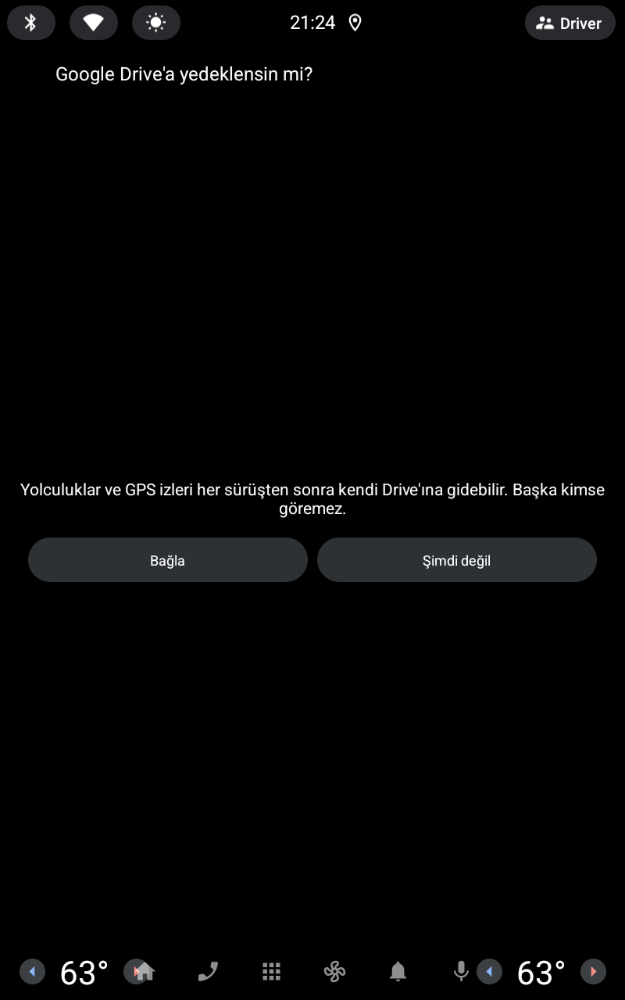

# EX30 Telemetry

[English](README.md) · **Türkçe**

**Volvo EX30** için, doğrudan aracın **Android Automotive OS** ekranında çalışan
bir yolculuk bilgisayarı ve araç verisi paneli. Her yolculuğu kendiliğinden
kaydeder; aracın kendi arayüzünde görünmeyen anlık tüketim, irtifa, hız ve enerji
verilerini gösterir.

> **Resmî olmayan proje.** Volvo Cars ile bağlantısı yoktur, Volvo tarafından
> onaylanmamış veya desteklenmemektedir. "Volvo" ve "EX30" sahiplerinin ticari
> markalarıdır; burada yalnızca uyumluluğu belirtmek için kullanılır.
> Bkz. [Sorumluluk reddi](#sorumluluk-reddi).

<p>
  
  
  
</p>
<p>
  
  
  
</p>

<sub>Canlı ekran (açık ve koyu tema), ilk açılıştaki Google Drive yedekleme
önerisi, yolculuk geçmişi, rekorlar ve araç verileri / ayarlar ekranı. AAOS
emülatöründe, debug derlemesinin sentetik demo verisiyle alındı.</sub>

## Özellikler

**Canlı ekran** (navigasyon yüzeyine çizilir, sürüş sırasında ekranda kalır)

- Son **10 / 20 / 50 km**'lik kayan pencerede tüketim (kWh/100 km), yanında
  yolculuğun tamamının ortalaması
- Aynı pencerede irtifa grafiği: en yüksek / en alçak nokta, toplam tırmanış /
  iniş, tırmanışa giden ve geri kazanılan (rejen) enerji
- Azami değerli hız grafiği; pencere ve yolculuk ortalama hızı yan yana
- Yeni bir performans rekoru kırıldığında şerit
- Aracın gece moduna uyan (ya da elle sabitlenebilen) açık / koyu tema

**Otomatik yolculuk kaydı**

- Araç hareket edince yolculuk başlar, park edildikten 60 sn sonra kaydedilir.
  Kırmızı ışıkta durmak yolculuğu bitirmez.
- Yolculuk başına: mesafe, süre, net enerji, rejen, şarj yüzdesi başlangıç →
  bitiş, gösterge menzili başlangıç → bitiş, dış sıcaklık, tırmanış / iniş,
  ortalama / azami hız, GPS mesafesi ile tekerlek mesafesi karşılaştırması
- **Menzil denetimi:** aracın menzil göstergesini gerçekte gidilen mesafeyle
  kıyaslar (iyimser / kötümser, mesafe ağırlıklı)
- Sürüş sırasında kendiliğinden yakalanan **rekorlar:** 0-60, 0-100, 80-120 km/h
  ve 100-0 km/h fren; örnekler arası interpolasyonla
- İstatistikler: toplamlar, ortalama tüketim, dış sıcaklık bandına göre tüketim

**Arka planda kayıt**

- **Otomatik başlatma:** konum iznine "her zaman" verilirse araç çalıştığı anda,
  uygulamayı açmaya gerek kalmadan yolculuk kaydedilir (bildirimli ön plan
  servisi; araç uykudan uyanınca ya da uygulama güncellenince yeniden başlar)
- **GPS izi:** her yolculuğun güzergâhı yaklaşık 1 Hz ile araçta saklanır (konum,
  GPS irtifası, hız, güç, şarj yüzdesi)

**Google Drive eşitleme (isteğe bağlı)**

- Araçta **kendi** Google hesabınızı bağlarsınız: araç bir kod gösterir, siz
  telefonunuzda `google.com/device` adresinde onaylarsınız
- Her sürüşten sonra yolculuk özeti ve GPS izi Drive'ınızdaki `EX30 Trips`
  klasörüne kendiliğinden yüklenir. Ağ yokken bekleyen yolculuklar sonra gider;
  ilk bağlantıda araçtaki yolculuk geçmişi de yüklenir.
- Uygulama yalnızca `drive.file` iznini alır: yalnızca kendi oluşturduğu
  dosyaları görür, Drive'ınızın geri kalanını göremez. Geliştiriciye ait bir
  sunucu yoktur.
- Dosya düzeni ve biçimleri: [drive-sync/PROTOKOL.md](drive-sync/PROTOKOL.md)

**Araç verileri / ayarlar**

- Ayarlar ve tanılama ekranı: Google hesabı, yükleme kuyruğu, otomatik başlatma,
  GPS izi durumu, ardından her araç sinyali, ölçülen örnekleme hızı ve
  çözünürlüğüyle
- **Property sondası:** aracın üçüncü parti uygulamalara gerçekte hangi verileri
  verdiğini listeler (Android 15 / araç yazılımı 2.1.2 birkaç yenisini açtı)
- Kendi analiziniz için ham ölçüm günlüğü (`calib.csv`)

**Dışa aktarma**

- **Dışa aktar:** kayıtları araçta `İndirilenler/EX30YolAnalizi/` altına kopyalar
- **Drive'a aktar:** Google hesabı bağlıysa ham kayıtları (`calib.csv`,
  `trips.json`, `records.json`) da `EX30 Trips` klasörünün köküne yükler
- Masaüstü tamamlayıcısı **EX30 Trip Viewer**, dışa aktarılan `trips.json`
  dosyasını Windows'ta grafiklerle gösterir. Not: şu an yayında olan Trip Viewer
  Drive'ı hâlâ eski Apps Script ucu üzerinden okuyor
  ([drive-sync/README.tr.md](drive-sync/README.tr.md)), yukarıdaki protokol 3
  dosyalarını değil.

Arayüz dilleri: **Türkçe** ve **İngilizce** (sistem diline göre).

## Gizlilik

- **Uygulama konum kaydeder.** Mesafe ve irtifa GPS'ten gelir; her yolculuğun
  güzergâhı (GPS izi) araçta, uygulamanın özel alanında saklanır. EX30'un
  odometresi ve dahili GPS sensörleri üçüncü parti uygulamalara açık değildir.
- **Otomatik başlatma** açıksa (konum "her zaman"), araç her sürüldüğünde kayıt
  arka planda da yapılır; çalışırken bir bildirim görünür. Bu izin yoksa kayıt
  yalnızca uygulama açıkken yapılır.
- **Google hesabı bağlamadıkça araçtan hiçbir şey çıkmaz.** Bağlarsanız
  yolculuk özetleri ve GPS izleri `drive.file` izniyle **yalnızca o hesabın
  kendi Google Drive'ına** gider. Bağlantıyı kesmek yüklemeyi durdurur ve
  token'ı Google'da da iptal eder; Drive'daki dosyalar siz silene kadar kalır.
- Google yenileme token'ı Android Keystore ile şifreli saklanır.
- Reklam, analitik, çökme raporlama veya üçüncü parti SDK yoktur.

## Derlemeden önce doldurmanız gerekenler

Kişisel değerler bu depodan çıkarıldı. Kendi değerinizi girmeniz gereken her
yer **BÜYÜK HARFLİ** bir yorumla işaretlidir.

| Ne | Nerede | Zorunlu mu? |
|---|---|---|
| Paket adı (`applicationId`) | `automotive/build.gradle.kts` | Kendi release derlemeniz için **evet**. Google Play `com.example.*` kabul etmez |
| İmza anahtarı | `keystore.properties.example` → `keystore.properties` olarak kopyalayın | Yalnızca imzalı release için |
| Google OAuth istemcisi | `oauth.properties.example` → `oauth.properties` olarak kopyalayın | İsteğe bağlı, Google Drive eşitleme için ([kurulum](#google-drive-eşitleme-isteğe-bağlı)) |
| Eski Apps Script ucu | `drive-sync/Kod.gs` (`PASTE-…` yer tutucuları) | Yalnızca eski Trip Viewer sürümleri için ([eski düzen](drive-sync/README.tr.md)) |

`keystore.properties`, `oauth.properties`, `client_secret_*.json`, `*.jks`,
`*.aab` ve `*.apk` `.gitignore` içindedir. **Bunları asla depoya eklemeyin.**

`oauth.properties` olmadan da uygulama derlenir ve normal çalışır; *Google
hesabı* satırı yalnızca istemci kimliğinin eksik olduğunu söyler.

## Google Drive eşitleme (isteğe bağlı)

Araçtaki uygulama Google'a **cihaz akışıyla** giriş yapar; bunun için kendi
Google Cloud OAuth istemcinizi açmanız gerekir. Ücretsizdir, başka kimsenin
verisiyle ilgisi yoktur.

1. [console.cloud.google.com](https://console.cloud.google.com) → yeni proje
   oluşturun (ör. `EX30 Telemetry`).
2. **APIs & Services → Library → Google Drive API → Enable.**
3. **Google Auth Platform → Branding / Audience:** izin ekranını *External*
   olarak kurun, sonra **yayınlayın ("In production")**. *Testing* durumunda
   yenileme token'ları 7 günde geçersiz olur. `drive.file` hassas bir izin
   olmadığı için Google incelemesi gerekmez.
4. **Data access:** `.../auth/drive.file`, `openid` ve `email` izinlerini ekleyin.
5. **Clients → Create client → TVs and Limited Input devices.** İstemci kimliğini
   ve sırrını `oauth.properties` içine `carClientId` ve `carClientSecret` olarak
   yazın.
6. İsteğe bağlı: **aynı projede** *Desktop app* türünde ikinci bir istemci açın
   (`desktopClientId`, `desktopClientSecret`). Bunu
   `drive-sync/oauth-dogrulama.py`, `drive-sync/drive-denetle.py` ve protokol 3'ü
   okuyan Trip Viewer sürümleri kullanır. Aynı projedeki istemciler birbirinin
   dosyalarını görür; başka bir projedeki istemci göremez.
7. Derleyip kurun. Araçta: **Ayarlar → Google hesabı** → telefonunuzda
   `google.com/device` adresini açıp kodu girin ve izin ekranında **Google Drive
   kutusunu da işaretleyin**. İşaretlenmezse hiçbir şey yüklenemez; uygulama
   eksik izni bildirir.

Cihaz ve masaüstü uygulamalarında Google istemci sırrını gizli saymaz; tek başına
kimsenin verisine erişim vermez. Yine de `oauth.properties` dosyasını depoya
eklemeyin.

Drive'a neyin gittiğini bilgisayardan kontrol etmek için (masaüstü istemcisi
gerekir):

```powershell
py -3 drive-sync/drive-denetle.py
```

## Derleme

Gereksinimler: Android Studio (JDK 17), Android SDK 35. Windows'ta proje
yolunda Türkçe karakter (ör. `ı`, `ü`) olmamalı; Android Gradle eklentisi böyle
bir yolda derlemeyi reddediyor.

```powershell
# Windows
$env:JAVA_HOME = "C:\Program Files\Android\Android Studio\jbr"
.\gradlew.bat :automotive:assembleDebug       # debug APK (emülatör)
.\gradlew.bat :automotive:testDebugUnitTest   # birim testleri
.\gradlew.bat :automotive:bundleRelease       # imzalı AAB (keystore.properties gerekir)
```

```bash
# macOS / Linux
./gradlew :automotive:assembleDebug
```

## Araca nasıl kurulur

- **Emülatör:** Android Studio'da *Automotive* tipi bir AVD oluşturun, debug
  APK'yı `adb` ile kurun. AAOS'ta sürücü profili genelde **user 10**'dur:

  ```bash
  PKG=com.example.ex30telemetry   # ya da kendi applicationId'niz
  adb install -r -t automotive/build/outputs/apk/debug/automotive-debug.apk
  adb shell pm grant --user 10 $PKG android.permission.ACCESS_FINE_LOCATION
  adb shell pm grant --user 10 $PKG android.permission.ACCESS_BACKGROUND_LOCATION   # otomatik başlatma
  adb shell am start --user 10 -n "$PKG/androidx.car.app.activity.CarAppActivity"
  ```

- **Gerçek araç:** bildiğimiz kadarıyla seri üretim araçlar ADB ile uygulama
  yüklemeye izin vermiyor. Pratik yol, **kendi Google Play Console** hesabınız
  (tek seferlik kayıt ücreti) → *Dahili test* kanalı; kendi paket adınız ve imza
  anahtarınızla yükleyip araçtaki Play Store'dan test hesabıyla kurmak.
  Android Automotive OS form faktörünü eklemek Google incelemesi gerektirir.

### Debug kancaları (yalnızca emülatör)

Emülatör araç hızı enjeksiyonuna izin vermiyor, `adb shell input tap` da host'un
düğmelerine ulaşmıyor. Bu yüzden **debug derlemesi** bir yayını dinler (release
derlemesine girmez):

```bash
adb shell am broadcast --user 10 -p $PKG -a $PKG.DEBUG --es cmd demo          # canlı ekranı sentetik değerlerle doldur
adb shell am broadcast --user 10 -p $PKG -a $PKG.DEBUG --es cmd live          # gerçek veriye dön
adb shell am broadcast --user 10 -p $PKG -a $PKG.DEBUG --es cmd screen --es to trips   # calib / probe / trips / records / live
```

## Klasör düzeni

```
automotive/src/main/java/.../
  JourneyService.kt, BootReceiver.kt   arka plan kayıt servisi + otomatik başlatma
  car/      araç property akışları, sonda, tekerlek odometresi
  trip/     yolculuk durum makinesi, biriktirici, GPS izi, rekorlar, menzil denetimi, kayıt
  render/   canlı ekran çizimi, tema ve pencere ayarları
  screen/   Car App Library ekranları (yolculuklar, ayrıntı, istatistik, rekorlar, ayarlar, Google girişi)
  google/   Google cihaz akışı girişi, şifreli token saklama, Drive REST istemcisi
  sync/     yükleme kuyruğu (giden kutusu) ve yolculuk gönderici
  calib/    ölçüm günlüğü, dışa aktarma, elle Drive'a yükleme
  loc/      konum
  debug/    yalnızca debug kancaları ve demo verisi
drive-sync/ Drive protokolü (PROTOKOL.md), yardımcı betikler, eski Apps Script ucu (Kod.gs)
play-assets/ simge ve tanıtım görseli
screenshots/ README görselleri (en-*, tr-*)
```

Kod yorumları çoğunlukla Türkçedir. Bazı yorumlar bu depoda bulunmayan dahili
geliştirme notlarına (`prompt.md`) atıf yapar.

## Sorumluluk reddi

Bu yazılım **"olduğu gibi", hiçbir garanti olmaksızın** sunulur. Araç verisini
herkese açık Android Automotive API'leri üzerinden okur, araçta değişiklik
yapmaz. Sürüş sırasında uygulamayla etkileşime girmeyin; güvenli ve yasal sürüşün
sorumluluğu tamamen sürücüdedir. Gösterilen değerler (tüketim, menzil,
performans süreleri) tahminidir ve hatalı olabilir.

## Lisans

Copyright (C) 2026 Anıl Erke

Bu program özgür yazılımdır: Özgür Yazılım Vakfı tarafından yayımlanan **GNU Genel
Kamu Lisansı**'nın 3. sürümü ya da (tercihinize göre) daha sonraki bir sürümü
koşulları altında yeniden dağıtabilir ve/veya değiştirebilirsiniz
(`GPL-3.0-or-later`).

Bu program faydalı olması umuduyla dağıtılmaktadır, ancak **HİÇBİR GARANTİSİ
YOKTUR**; SATILABİLİRLİK veya BELİRLİ BİR AMACA UYGUNLUK zımni garantisi dahi
yoktur. Bağlayıcı olan, [LICENSE](LICENSE) dosyasındaki İngilizce tam metindir.

Kısacası: bu kodu kullanabilir, inceleyebilir, değiştirebilir ve paylaşabilirsiniz.
Değiştirilmiş bir sürümü dağıtırsanız (uygulama mağazasında yayınlamak dahil),
onun kaynak kodunu da aynı lisansla açmanız gerekir.
