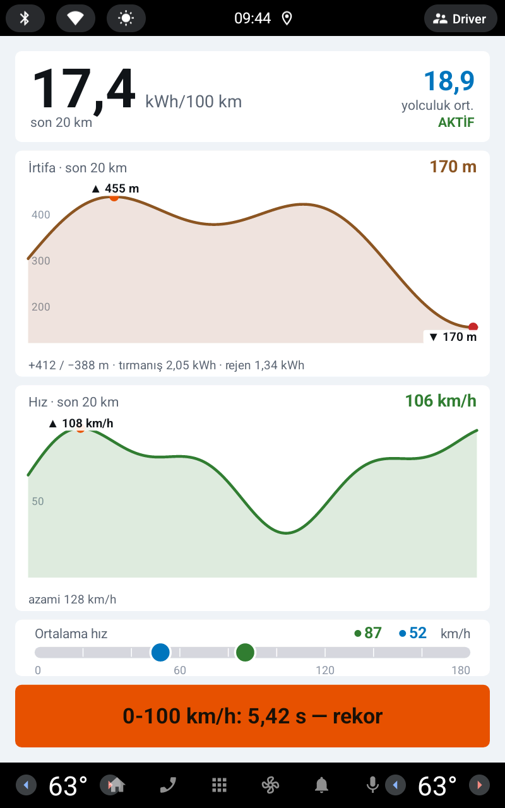
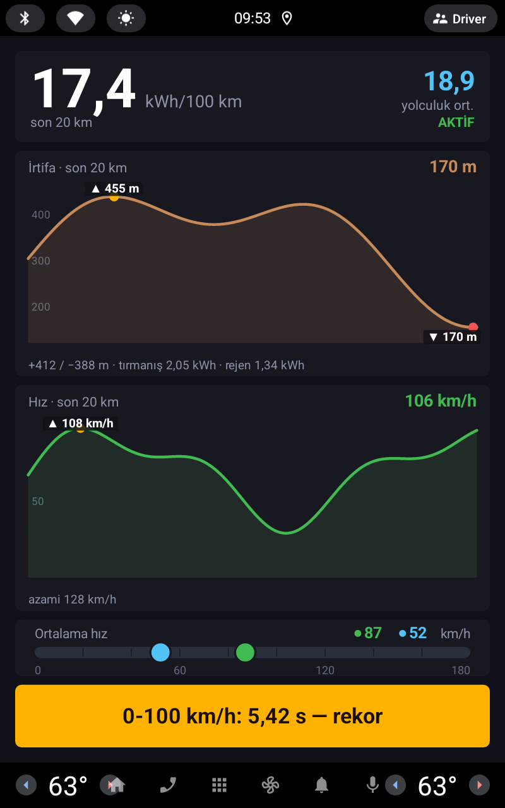
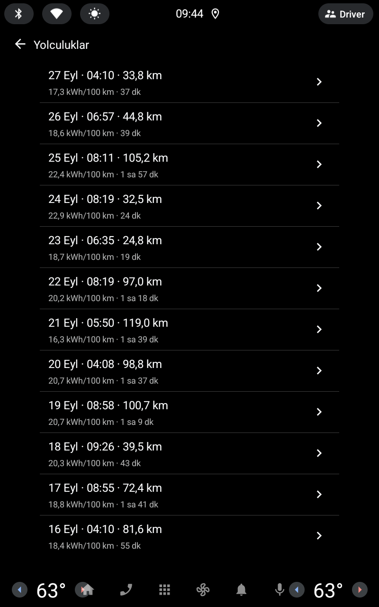
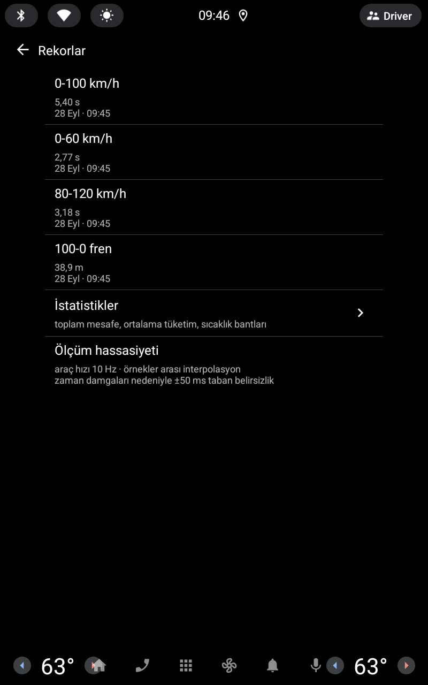
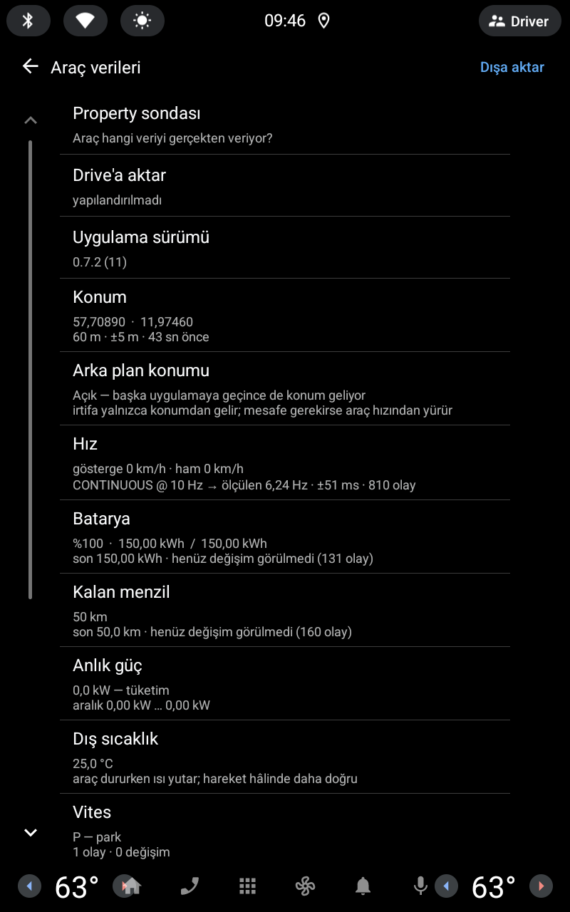

# EX30 Telemetry

[English](README.md) · **Türkçe**

**Volvo EX30** için, doğrudan aracın **Android Automotive OS** ekranında çalışan
bir yolculuk bilgisayarı ve araç verisi paneli. Her yolculuğu kendiliğinden
kaydeder; aracın kendi arayüzünde görünmeyen anlık tüketim, irtifa, hız ve enerji
verilerini gösterir.

> **Resmî olmayan proje.** Volvo Cars ile bağlantısı yoktur, Volvo tarafından
> onaylanmamış veya desteklenmemektedir. "Volvo" ve "EX30" sahiplerinin ticari
> markalarıdır; burada yalnızca uyumluluğu belirtmek için kullanılır.
> Bkz. [Sorumluluk reddi](#sorumluluk-reddi).

<p>
  
  
</p>
<p>
  
  
  
</p>

<sub>Canlı ekran (açık ve koyu tema), yolculuk geçmişi, rekorlar ve araç verileri.
AAOS emülatöründe, debug derlemesinin sentetik demo verisiyle alındı.</sub>

## Özellikler

**Canlı ekran** (navigasyon yüzeyine çizilir, sürüş sırasında ekranda kalır)

- Son **10 / 20 / 50 km**'lik kayan pencerede tüketim (kWh/100 km), yanında
  yolculuğun tamamının ortalaması
- Aynı pencerede irtifa grafiği: en yüksek / en alçak nokta, toplam tırmanış /
  iniş, tırmanışa giden ve geri kazanılan (rejen) enerji
- Azami değerli hız grafiği; pencere ve yolculuk ortalama hızı yan yana
- Yeni bir performans rekoru kırıldığında şerit
- Aracın gece moduna uyan (ya da elle sabitlenebilen) açık / koyu tema

**Otomatik yolculuk kaydı**

- Araç hareket edince yolculuk başlar, park edildikten 60 sn sonra kaydedilir.
  Kırmızı ışıkta durmak yolculuğu bitirmez.
- Yolculuk başına: mesafe, süre, net enerji, rejen, şarj yüzdesi başlangıç →
  bitiş, gösterge menzili başlangıç → bitiş, dış sıcaklık, tırmanış / iniş,
  ortalama / azami hız, GPS mesafesi ile tekerlek mesafesi karşılaştırması
- **Menzil denetimi:** aracın menzil göstergesini gerçekte gidilen mesafeyle
  kıyaslar (iyimser / kötümser, mesafe ağırlıklı)
- Sürüş sırasında kendiliğinden yakalanan **rekorlar:** 0-60, 0-100, 80-120 km/h
  ve 100-0 km/h fren; örnekler arası interpolasyonla
- İstatistikler: toplamlar, ortalama tüketim, dış sıcaklık bandına göre tüketim

**Araç verisi / tanılama**

- Her araç sinyalini, ölçülen örnekleme hızını ve çözünürlüğünü gösteren ekran
- **Property sondası:** aracın üçüncü parti uygulamalara gerçekte hangi verileri
  verdiğini listeler (Android 15 / araç yazılımı 2.1.2 birkaç yenisini açtı)
- Kendi analiziniz için ham ölçüm günlüğü (`calib.csv`)

**Dışa aktarma**

- **Dışa aktar:** kayıtları araçta `İndirilenler/EX30YolAnalizi/` altına kopyalar
- **Drive'a aktar (isteğe bağlı):** kayıtları, sizin kurduğunuz küçük bir Apps
  Script üzerinden **kendi** Google Drive klasörünüze gönderir
  ([drive-sync/](drive-sync/README.md)). Geliştiriciye ait bir sunucu yoktur.
- Masaüstü tamamlayıcısı **EX30 Trip Viewer**, dışa aktarılan `trips.json`
  dosyasını Windows'ta grafiklerle gösterir.

Arayüz dilleri: **Türkçe** ve **İngilizce** (sistem diline göre).

## Gizlilik

- Bütün veri araçta, uygulamanın özel alanında kalır.
- **Siz** *Dışa aktar* ya da *Drive'a aktar*'a basmadıkça hiçbir yere bir şey
  gönderilmez. Drive aktarımı yalnızca sizin yapılandırdığınız adrese gider.
- Reklam, analitik, çökme raporlama veya üçüncü parti SDK yoktur.
- Konum, mesafe ve irtifayı hesaplamak için kullanılır. EX30'un odometresi ve
  dahili GPS sensörleri üçüncü parti uygulamalara açık değildir.

## Derlemeden önce doldurmanız gerekenler

Kişisel değerler bu depodan çıkarıldı. Kendi değerinizi girmeniz gereken her
yer **BÜYÜK HARFLİ** bir yorumla işaretlidir.

| Ne | Nerede | Zorunlu mu? |
|---|---|---|
| Paket adı (`applicationId`) | `automotive/build.gradle.kts` | Kendi release derlemeniz için **evet**. Google Play `com.example.*` kabul etmez |
| İmza anahtarı | `keystore.properties.example` → `keystore.properties` olarak kopyalayın | Yalnızca imzalı release için |
| Drive aktarım adresi | `drive.properties.example` → `drive.properties` olarak kopyalayın | İsteğe bağlı |
| Drive klasör kimliği + iki anahtar | `drive-sync/Kod.gs` (`PASTE-…` yer tutucuları) | İsteğe bağlı |

`keystore.properties`, `drive.properties`, `*.jks`, `*.aab` ve `*.apk`
`.gitignore` içindedir. **Bunları asla depoya eklemeyin.**

## Derleme

Gereksinimler: Android Studio (JDK 17), Android SDK 35.

```powershell
# Windows
$env:JAVA_HOME = "C:\Program Files\Android\Android Studio\jbr"
.\gradlew.bat :automotive:assembleDebug       # debug APK (emülatör)
.\gradlew.bat :automotive:testDebugUnitTest   # birim testleri
.\gradlew.bat :automotive:bundleRelease       # imzalı AAB (keystore.properties gerekir)
```

```bash
# macOS / Linux
./gradlew :automotive:assembleDebug
```

## Araca nasıl kurulur

- **Emülatör:** Android Studio'da *Automotive* tipi bir AVD oluşturun, debug
  APK'yı `adb` ile kurun. AAOS'ta sürücü profili genelde **user 10**'dur:

  ```bash
  PKG=com.example.ex30telemetry   # ya da kendi applicationId'niz
  adb install -r -t automotive/build/outputs/apk/debug/automotive-debug.apk
  adb shell pm grant --user 10 $PKG android.permission.ACCESS_FINE_LOCATION
  adb shell am start --user 10 -n "$PKG/androidx.car.app.activity.CarAppActivity"
  ```

- **Gerçek araç:** bildiğimiz kadarıyla seri üretim araçlar ADB ile uygulama
  yüklemeye izin vermiyor. Pratik yol, **kendi Google Play Console** hesabınız
  (tek seferlik kayıt ücreti) → *Dahili test* kanalı; kendi paket adınız ve imza
  anahtarınızla yükleyip araçtaki Play Store'dan test hesabıyla kurmak.
  Android Automotive OS form faktörünü eklemek Google incelemesi gerektirir.

### Debug kancaları (yalnızca emülatör)

Emülatör araç hızı enjeksiyonuna izin vermiyor, `adb shell input tap` da host'un
düğmelerine ulaşmıyor. Bu yüzden **debug derlemesi** bir yayını dinler (release
derlemesine girmez):

```bash
adb shell am broadcast --user 10 -p $PKG -a $PKG.DEBUG --es cmd demo          # canlı ekranı sentetik değerlerle doldur
adb shell am broadcast --user 10 -p $PKG -a $PKG.DEBUG --es cmd live          # gerçek veriye dön
adb shell am broadcast --user 10 -p $PKG -a $PKG.DEBUG --es cmd screen --es to trips   # calib / probe / trips / records / live
```

## Klasör düzeni

```
automotive/src/main/java/.../
  car/      araç property akışları, sonda, tekerlek odometresi
  trip/     yolculuk durum makinesi, biriktirici, rekorlar, menzil denetimi, kayıt
  render/   canlı ekran çizimi, tema ve pencere ayarları
  screen/   Car App Library ekranları (yolculuklar, ayrıntı, istatistik, rekorlar, tanılama)
  calib/    ölçüm günlüğü, dışa aktarma, Drive'a yükleme
  loc/      konum + ön plan servisi
  debug/    yalnızca debug kancaları ve demo verisi
drive-sync/ isteğe bağlı Google Apps Script ucu (Kod.gs)
play-assets/ simge ve tanıtım görseli
screenshots/ README görselleri (en-*, tr-*)
```

Kod yorumları çoğunlukla Türkçedir. Bazı yorumlar bu depoda bulunmayan dahili
geliştirme notlarına (`prompt.md`) atıf yapar.

## Sorumluluk reddi

Bu yazılım **"olduğu gibi", hiçbir garanti olmaksızın** sunulur. Araç verisini
herkese açık Android Automotive API'leri üzerinden okur, araçta değişiklik
yapmaz. Sürüş sırasında uygulamayla etkileşime girmeyin; güvenli ve yasal sürüşün
sorumluluğu tamamen sürücüdedir. Gösterilen değerler (tüketim, menzil,
performans süreleri) tahminidir ve hatalı olabilir.

## Lisans

Copyright (C) 2026 Anıl Erke

Bu program özgür yazılımdır: Özgür Yazılım Vakfı tarafından yayımlanan **GNU Genel
Kamu Lisansı**'nın 3. sürümü ya da (tercihinize göre) daha sonraki bir sürümü
koşulları altında yeniden dağıtabilir ve/veya değiştirebilirsiniz
(`GPL-3.0-or-later`).

Bu program faydalı olması umuduyla dağıtılmaktadır, ancak **HİÇBİR GARANTİSİ
YOKTUR**; SATILABİLİRLİK veya BELİRLİ BİR AMACA UYGUNLUK zımni garantisi dahi
yoktur. Bağlayıcı olan, [LICENSE](LICENSE) dosyasındaki İngilizce tam metindir.

Kısacası: bu kodu kullanabilir, inceleyebilir, değiştirebilir ve paylaşabilirsiniz.
Değiştirilmiş bir sürümü dağıtırsanız (uygulama mağazasında yayınlamak dahil),
onun kaynak kodunu da aynı lisansla açmanız gerekir.
